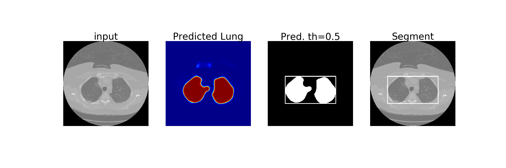

# OSU Lung Segmentation with 2D UNet in CT

Lung Lobe Segmentation model based on a 2D U-Net. The model is trained with CT sequences and the corresponding lung masks. The data is in [3]. The training images are enhanced and re-sized to 256 x 256 before feeding to the network. The model is trained in The Ohio State University Wexner Medical Center, Department of Radiology, using Python, Tensorflow Keras API, and trained on an NVIDIA QuadroGV100 system with CUDA/CuDNNv9 dependecies. 

Requirements: Python, Tensorflow Keras API, SimpleITK, OpenCV, Numpy, Matplotlib

References
---
1)	U-Net: Convolutional Networks for Biomedical Image Segmentation https://lmb.informatik.uni-freiburg.de/people/ronneber/u-net/
2)	U-Net Architecture implementation https://github.com/zhixuhao/unet
3)	Training Data: https://www.kaggle.com/kmader/finding-lungs-in-ct-data 
4)  Laboratory for Augmented Intelligence in Imaging, The Ohio State University Wexner Medical Center,Department of Radiology
